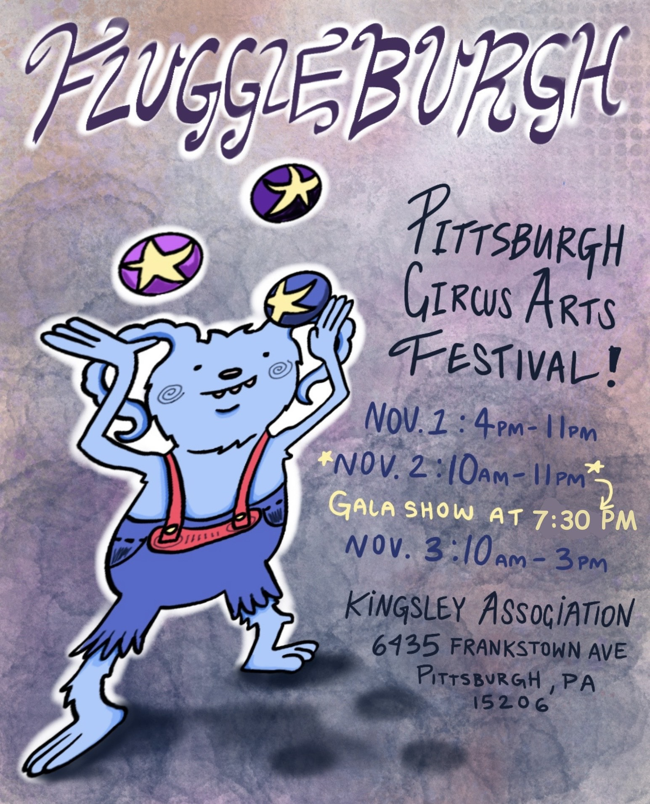
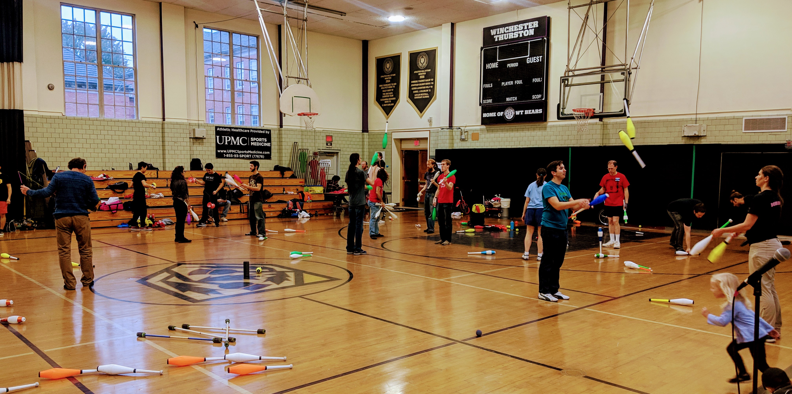
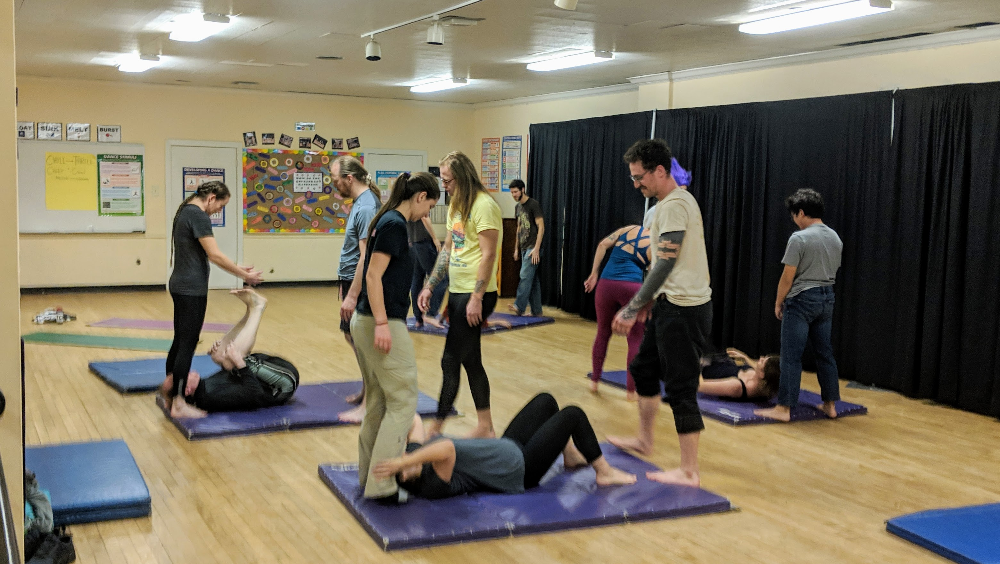
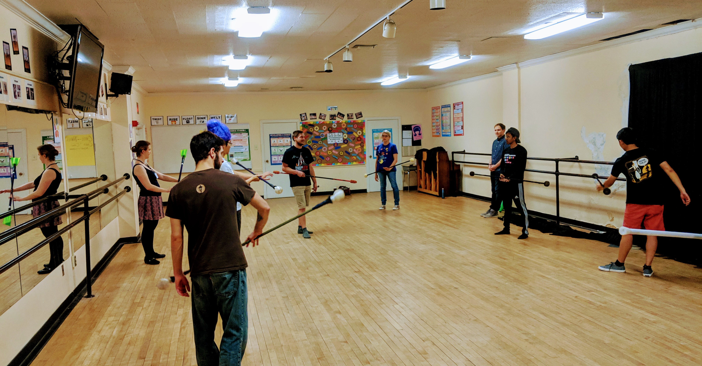
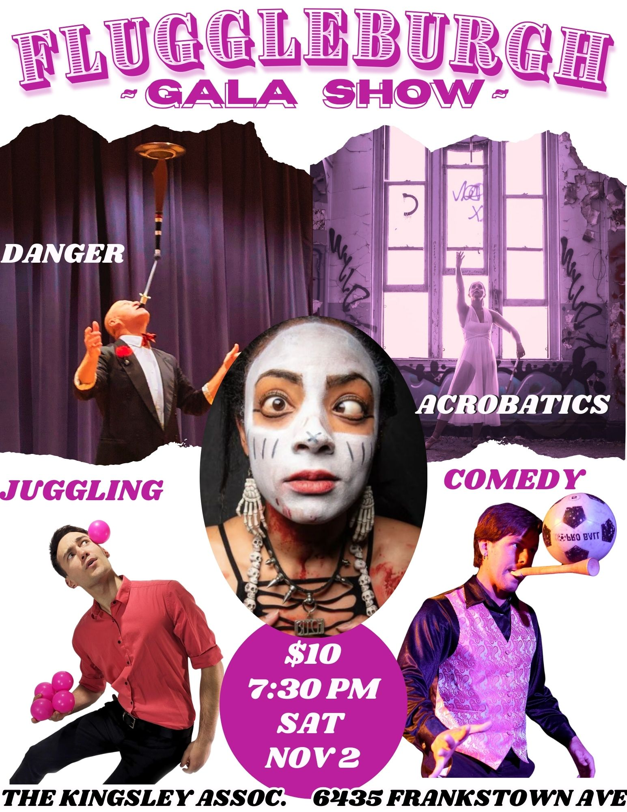

# FluggleBurgh 2025

**juggling * acro * flow arts * circus**

**Nov 7-9, 2025 - Pittsburgh, PA**

[Facebook Event](https://www.facebook.com/events/788635177290502)

Tickets: [Card payment (tbd)], [[Cash payment](https://forms.gle/6pGEZtToC7VnEv967)]

<!--  -->

---

## About

**FluggleBurgh** is a 3-day festival for all circus and skill arts hosted by  Pittsburghs juggling, acro, clowning, and flow arts community (FluggleBurgh = *fl*ow + j*uggle* + pitts*burgh*). It will be again at the The Kingsley Association in the east-end of Pittsbugh. FluggleBurgh will provide a communal practice space in a large gym with tall ceilings, classrooms with scheduled workshops all weekend, outdoor practice and fire space (weather permitting), object manipulation games/competition, and shows. All activities will be in the same space. All walks of object manipulation, circus arts, and movement arts are welcome. 

In spirit, it is a successor of the [Not Quite Pittsburgh Juggling Festival](https://www.youtube.com/watch?v=_janE-erfKc) (2008-2015), but it's now within the Pittsburgh city limits.

Our ongoing goal of this festival is to bring the various communities around circus arts and other skills from Pittsburgh and beyond together, share workshops, and showcase the various skills in a show. We expect plenty of juggling, acrobatics, and flow workshops, as well as some clowning, balloons, and maybe even magic and unicycling.

 

 

## Program (subject to change)

**Gym times (open practice, workshops)** 

* Friday Nov 7, 2025, 5pm-11pm (it's not too late to still wear Halloween costumes)
* Saturday Nov 8, 2025, 10am-11pm (gym closes at 6pm to prepare for the show, reopens after the show)
* Sunday Nov 9, 2025, 9am-3pm

To cover the costs of the festival, we ask for $10 per day for access to the gym and the workshops on Friday and Saturday (Sunday free). Youth under 18 (must be accompanied by an adult), locals within walking distance from the Kingsley Association, and all Kingsley Association Members can attend for free. 
<!-- Tickets can be bought on site or [online](https://operations.daxko.com/online/5337/ProgramsV2/Events.mvc/offering?guid=664f1c27-7f43-11ef-99cf-005056924804). -->

**Fire Jam (Friday Nov 7, after dark, free)** 

The fire jam is informal and will be outside in the parking lot, weather permitting, roughly 7 to 9pm. It will be canceled or rescheduled in case of heavy rain. 

Last year we also had a glow toy jam afterward inside.

**FluggleBurgh Gala Show (Saturday Nov 8, 7:30-9pm, $10, Kingsley Association)** 

FluggleBurgh Gala Show: The Gala show on Saturday will be at the Kingsley Association as well. It will feature various circus acts, including juggling, flow, and acro. As usual [O’Ryan The O'Mazing](https://www.oryantheomazing.com) will guide through the show. 

Show tickets can be bought for $10 in the gym during the festival, at the door, or online (tdb).
<!-- [online](https://operations.daxko.com/online/5337/ProgramsV2/Events.mvc/offering?guid=664f1c27-7f43-11ef-99cf-005056924804).  -->
Doors open about 20-30 min before the show. 

**Underground Renegade Show (Saturday 11:30pm, free)**

We will likely have a small renegade show in a secret location late on Saturday. We will share the location in the gym on Saturday after the show.

**Games (Sunday 11am)**

Watch or compete in various, mostly silly, juggling and circus games. Approachable for all.

**Workshop Schedule** 

We have various workshops throughout the weekend. Look for last minute changes, but this is the plan right now:

<iframe src="https://docs.google.com/spreadsheets/d/e/2PACX-1vSuThN_6EeRbhAmElJ5sEvNvuYTJeuCR-BH67Nu0aG3FZYwkSv2PfwWNvx2TlucFrK9Sj8x1JeNOHUj/pubhtml?gid=0&amp;single=true&amp;widget=true&amp;headers=false"   width="800" height="600" frameborder="0" style="border:0" ></iframe>

For **absolute beginners**, we teach anybody how to start juggling at the front desk throughout the entire festival (free, no gym fee required, no prior experience required, open to the general public).
For those who want to go beyond the basics, we have more *beginner-friendly workshops* throughout the weekend.

Interested in teaching a workshop? [Let us know](https://forms.gle/GN35Lmzq8WMMTxYy7).

<!--  -->

## Where

With the exception of the Renegade show, all activities (gym, workshops, shows) will be at **The Kingsley Association** [6435 Frankstown Ave, Pittsburgh, PA 15206](https://www.google.com/maps/place/Kingsley+Association/@40.461283,-79.9164184,18z/data=!3m1!4b1!4m9!3m8!1s0x8834ed8bc3666227:0x9336f9b9a5dd0598!5m2!1s2017-11-10!2i2!8m2!3d40.461283!4d-79.9152007!16s%2Fg%2F1td72nkj!5m1!1e2?entry=ttu&g_ep=EgoyMDI0MDkwNC4wIKXMDSoASAFQAw%3D%3D)

Parking is available in front of and behind the building as well as on nearby streets. Parking can get busy around the show time, plan accordingly. The Kingsley Association is in the East End of Pittsburgh and close to numerous bus stops (including 75, 77, 82, 86, and with a short walk also 28X, P1, 71B, 71C, 71D, 88, 89). There are three hotels and several restaurants within walking distance.

<iframe src="https://www.google.com/maps/d/embed?mid=1i5Fsia1IFpG3NDpUvXQ1bzAsSlFe67I"  width="800" height="600" frameborder="0" style="border:0" allowfullscreen></iframe>

## T-Shirts

We will sell t-shirts on site. You can also custom order one with our designs [online](https://jugglingjill.myspreadshop.com/).

## Contact

Contact us on [Facebook](https://www.facebook.com/events/788635177290502/) or send an [email](mailto:kaestner@cs.cmu.edu)
