# Masters of Flying Objects

## The Carnegie Mellon University Juggling Club

We are the juggling club of the **Carnegie Mellon University** in **Pittsburgh**, open to students and non-students. Whether you already know how to  juggle or want to learn, just come and join us and have some fun.

### Festival

The next [FluggleBurgh](https://www.andrew.cmu.edu/user//juggle/festival/) juggling festival is scheduled for **November 7-9, 2025**.

### Juggle With Us!

We meet twice a week on the CMU or Pitt campus:

* **Sundays at 4 PM**, on the cut (the central green space on the CMU campus) when the weather is nice and in the atrium of Newell Simon Hall if it is not
* **Thursdays at 5 PM** by the Pitt Juggling Club, usually outside the Carnegie Library on Schenley Plaza

Every meeting is announced on our mailing list a couple of hours in advance. You might find short-notice location changes, extra dates, or cancellations there. You can see recent messages in the public [mailing list archive](https://www.mail-archive.com/juggling-members@lists.andrew.cmu.edu/) without subscribing.

If you’re driving, parking in the [Morewood lot](https://www.cmu.edu/transportation/park/visitor.html) is free after 5 PM on weekdays and all day on weekends.

### Subscribe To Our Mailing List!

The [mailing list](https://lists.andrew.cmu.edu/mailman/listinfo/juggling-members) is our main mechanism for announcing meeting times and places and other juggling-related events. You can see recent messages in the [mailing list archive](https://www.mail-archive.com/juggling-members@lists.andrew.cmu.edu/). We have a [Facebook page](http://www.facebook.com/groups/10387203602/) too, though we more actively use the mailing list.

<a name="campus-map" />

### Campus Map

<iframe src="https://www.google.com/maps/d/u/0/embed?mid=1lmCJ-qBsnIVyRdnGVq4MYtTE8QlGcJYF" height="500" frameborder="0" style="border: 0; width: 100%;" allowfullscreen=""></iframe>

<a href="photos/IMG_20190828_183237~2.jpg" data-lightbox-gallery="gallery1">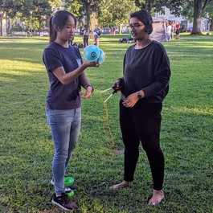</a>

<a href="photos/IMG_20190828_184712~2.jpg" data-lightbox-gallery="gallery1">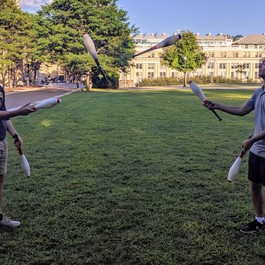</a>

<a href="photos/MVIMG_20190828_181504~2.jpg" data-lightbox-gallery="gallery1">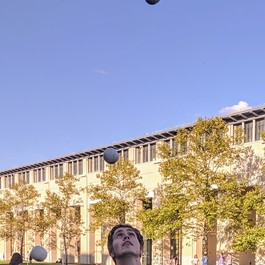</a>

<a href="photos/MVIMG_20190828_181602~2.jpg" data-lightbox-gallery="gallery1">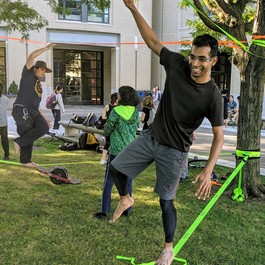</a>

<a href="photos/MVIMG_20190828_181950~2.jpg" data-lightbox-gallery="gallery1">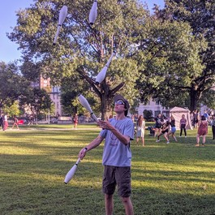</a>

<a href="photos/MVIMG_20190828_182321~2.jpg" data-lightbox-gallery="gallery1">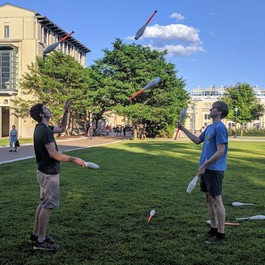</a>

<a href="photos/MVIMG_20190828_182527~2.jpg" data-lightbox-gallery="gallery1">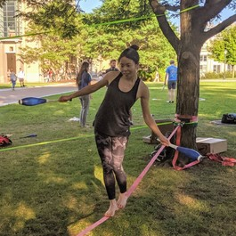</a>

<a href="photos/MVIMG_20190828_183046~2.jpg" data-lightbox-gallery="gallery1">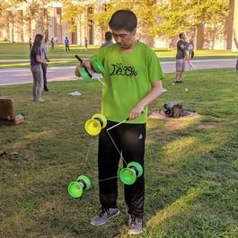</a>

<a href="photos/MVIMG_20190828_183107~2.jpg" data-lightbox-gallery="gallery1">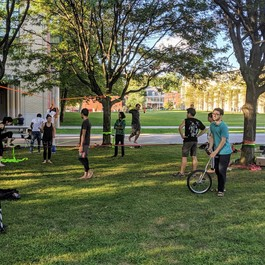</a>

<a href="photos/pic10.jpg" data-lightbox-gallery="gallery1">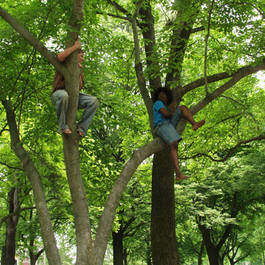</a>

<a href="photos/pic11.jpg" data-lightbox-gallery="gallery1">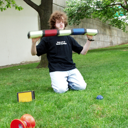</a>

<a href="photos/pic12.jpg" data-lightbox-gallery="gallery1">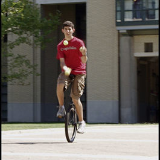</a>

<a href="photos/pic13.jpg" data-lightbox-gallery="gallery1">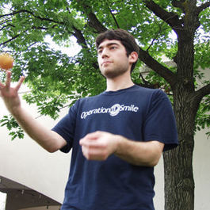</a>

<a href="photos/pic1.jpg" data-lightbox-gallery="gallery1">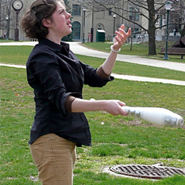</a>

<a href="photos/pic2013-1.jpg" data-lightbox-gallery="gallery1">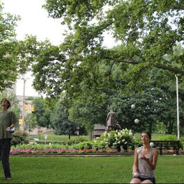</a>

<a href="photos/pic2013-2.jpg" data-lightbox-gallery="gallery1">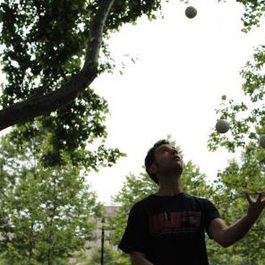</a>

<a href="photos/pic2013-3.jpg" data-lightbox-gallery="gallery1">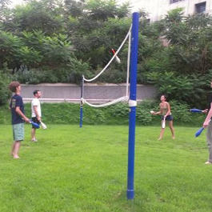</a>

<a href="photos/pic2.jpg" data-lightbox-gallery="gallery1">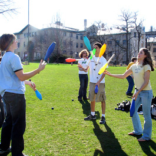</a>

<a href="photos/pic3.jpg" data-lightbox-gallery="gallery1">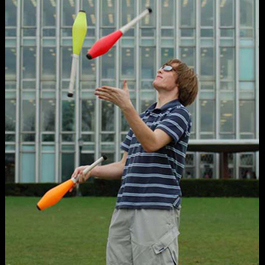</a>

<a href="photos/pic5.jpg" data-lightbox-gallery="gallery1">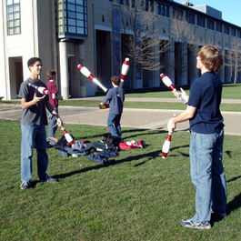</a>

<a href="photos/pic6.jpg" data-lightbox-gallery="gallery1">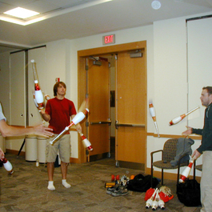</a>

<a href="photos/pic7.jpg" data-lightbox-gallery="gallery1">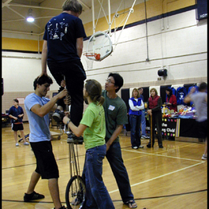</a>

<a href="photos/pic8.jpg" data-lightbox-gallery="gallery1">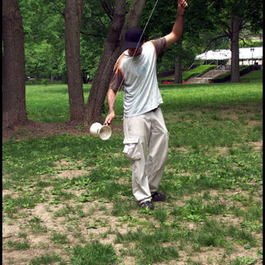</a>

<a href="photos/pic9.jpg" data-lightbox-gallery="gallery1">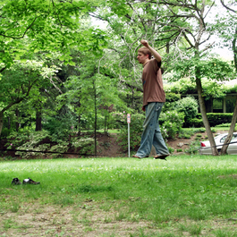</a>

### About Us

The Masters of Flying Objects is a juggling club at Carnegie Mellon  University. It is open to all members of the Carnegie Mellon community  as well as anyone in the greater Pittsburgh area. We welcome people of  all levels of ability, and we are happy to teach people with no prior  juggling experience.

We meet frequently, usually twice a week during the school year.  Check the mailing list and info above to find our next meeting date and  location. If you have any questions about the club, don’t hesitate to  contact us or our members — preferably over the mailing list.

The purpose of *Masters of Flying Objects* is to provide and  foster an environment for those interested in the art of juggling in  which they can meet, share and develop talents, teach skills, and share  equipment. The club will promote and teach the art of juggling,  contribute to the available recreational activities on campus, represent Carnegie Mellon University in the greater juggling community, and  provide juggling-related opportunities to the campus and local  community.

For details, see the complete copy of our [constitution](https://www.andrew.cmu.edu/user/juggle/constitution.pdf).

Officers:

* President: Jack Kiefer
* Vice President: Helen Amon
* Secretary: Steven Gailey
* Faculty advisor: Christian Kästner

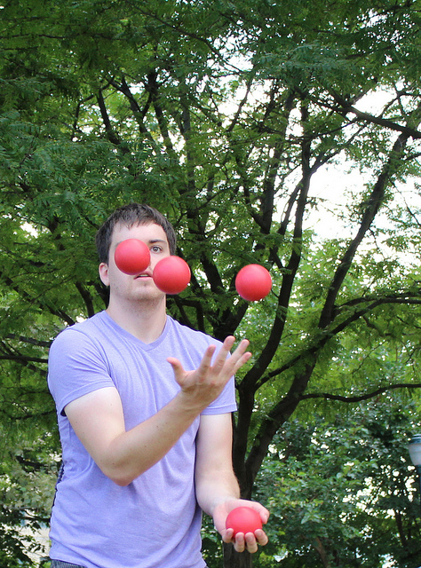
